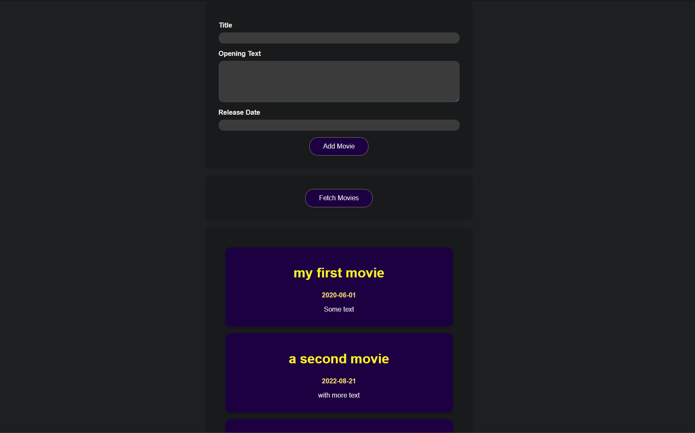

# GameInfo - [Demo](https://swapi-app-iota.vercel.app/)

### Create and collect a movie data by simply filling the form!

#### In this application you can get information about all the moves that you have added manually. I created this app in order to practice with the backend and sending Htttp Requests(e.g. Connecting to a Database). I used Google Firebase in order to store the new added/create movies data.

### Tech Stacks

`React.js`, `Google Firebase`, and `Hooks`.
